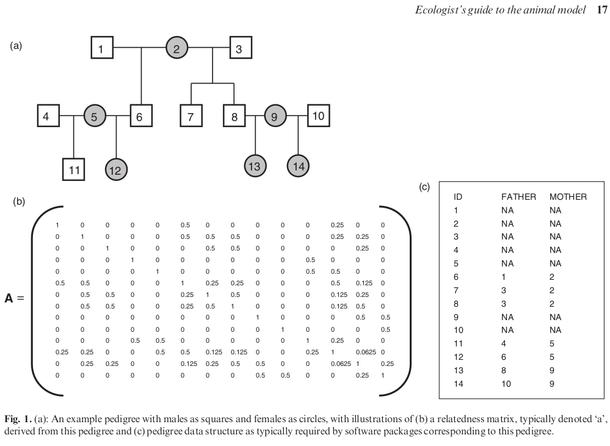

```{r setup, include=FALSE}
library(LM2GLMM)
library(spaMM)
library(lme4)
library(car)
spaMM.options(nb_cores = 4L)
options(width = 120)
knitr::opts_chunk$set(cache = TRUE, cache.path = "./cache_knitr/LMM_multi/", fig.path = "./fig_knitr/LMM_multi/", fig.width = 5, fig.height = 5, fig.align = "center")
```

## Mixed-effects models

* 4.0 [Introduction](./LMM_intro.html)
* 4.1 [More than one random effect](./LMM_multi.html)
* 4.2 [More extensions from simple LMM](./LMM_more.html)


## You will learn in this session

* how to study variation using mixed-models, including heritability
* how to perform phylogenetic regressions as well as meta-analyses using mixed models
* that mixed models can do a lot, but that they are a bit tedious


# Slightly more complex random structures

## The ```lme4::Penicillin``` dataset

```{r}
str(Penicillin)
table(Penicillin$sample, Penicillin$plate)
```

## The ```lme4::Penicillin``` dataset

### The random effects are "crossed"

```{r}
mod <- fitme(diameter ~ 1 + (1|plate) + (1|sample), data = Penicillin)
mod$lambda
```
<div class="columns-2">

  ```{r}
head(mod$ZAlist[[1]])
```

```{r}
head(mod$ZAlist[[2]], 10)
```
</div>


  ## The ```lme4::cake``` dataset

  ```{r}
head(cake)
str(cake)
```


## The ```lme4::cake``` dataset

```{r}
table(cake$recipe, cake$replicate, cake$temperature)
```


## The ```lme4::cake``` dataset

### The random effect is nested within a fixed effect:

```{r}
mod <- fitme(angle ~ recipe + temperature + (1|recipe:replicate), data = cake)
mod$lambda
```


## The ```lme4::cake``` dataset

### The random effect is nested within a fixed effect (alternative):

```{r}
cake$replicate_tot <- factor(paste(cake$recipe, cake$replicate, sep = "_"))
levels(cake$replicate_tot)
mod <- fitme(angle ~ recipe + temperature + (1|replicate_tot), data = cake)
mod$lambda
```


## The ``` carnivora``` dataset

```{r}
data("carnivora", package = "ape")
carnivora$log_brain <- log(carnivora$SB)
carnivora$log_body <- log(carnivora$SW)
str(carnivora)
```


## The ``` carnivora``` dataset

```{r}
tapply(carnivora$Genus, carnivora$Family, function(x) length(unique(x)))
```


## The ``` carnivora``` dataset

```{r}
coplot(log_brain ~ log_body | Family, data = carnivora)
```


## The ``` carnivora``` dataset

### Two nested random effects:

```{r}
mod1 <- fitme(log_brain ~ log_body + (1|Family/Genus), data = carnivora)
mod1
```


## The ``` carnivora``` dataset

### Two nested random effects:

```{r}
mod1bis <- fitme(log_brain ~ log_body + (1|Family) + (1|Family:Genus), data = carnivora)
mod1bis
```


## The ``` carnivora``` dataset

### Two nested random effects:

```{r}
mod1ter <- fitme(log_brain ~ log_body + (1|Family) + (1|Genus), data = carnivora)
mod1ter
```


## The ``` carnivora``` dataset

### Two nested random effects:

<br>

  * the formula ```(1|Family/Genus)```
* the formula ```(1|Family) + (1|Family:Genus)```
* the formula ```(1|Family) + (1|Genus)```

are the same as long as genus are not be recycled between families!


  ## Checking the random structure

  ### You can check the Z matrices to make sure you did it right

  ```{r}
crossprod(as.matrix(mod1$ZAlist[[1]]))
```


## Checking the random structure

### You can check the Z matrices to make sure you did it right

```{r}
crossprod(as.matrix(mod1$ZAlist[[2]]))
```


## Checking the random structure

### You can also use the ```model.matrix``` clone from ```lme4```:

```{r}
lF <- lFormula(log_brain ~ log_body + (1|Family) + (1|Genus), data = carnivora)
lF$reTrms$flist  ## list of grouping factors used in the random-effects terms; see ?mkReTrms
```


## Checking the random structure

### You can also check the BLUPs structure

```{r}
lapply(ranef(mod1), head, n = 20)
```

# Random slopes


## Fitting a random slope model

```{r}
mod3 <- fitme(log_brain ~ log_body + (log_body|Family) + (1|Genus), data = carnivora)
mod3
```


## The BLUPs for the slopes

```{r}
ranef(mod3)$`( log_body | Family )`
```


## Predictions

```{r, fig.width = 4, fig.height = 4}
plot(log_brain ~ log_body, data = subset(carnivora, Family == "Felidae"), col = "red",
     ylim = range(carnivora$log_brain), xlim = range(carnivora$log_body))
points(log_brain ~ log_body, data = subset(carnivora, Family == "Mustelidae"), col = "blue")
points(log_brain ~ log_body, data = subset(carnivora, Family == "Viverridae"), col = "orange")
abline(mod3$fixef + ranef(mod3)$`( log_body | Family )`["Felidae", ], col = "red", lwd = 2, lty = 2)
abline(mod3$fixef + ranef(mod3)$`( log_body | Family )`["Mustelidae", ], col = "blue", lwd = 2, lty = 2)
abline(mod3$fixef + ranef(mod3)$`( log_body | Family )`["Viverridae", ], col = "orange", lwd = 2, lty = 2)
```


## Practice

<br>

  Perform the predictions of all slopes using the function predict instead, both using ```spaMM``` and ```lme4```.


## Testing if slopes differ between families

```{r}
mod4 <- lmer(log_brain ~ log_body + (log_body|Family) + (1|Genus), data = carnivora, REML = FALSE)
mod4noRS <- lmer(log_brain ~ log_body + (1|Family) + (1|Genus), data = carnivora, REML = FALSE)
anova(mod4, mod4noRS)
```

```{r}
mod5 <- lm(log_brain ~ log_body * Family, data = carnivora)
mod5noIS <- lm(log_brain ~ log_body + Family, data = carnivora)
anova(mod5, mod5noIS)
```


## Testing if slopes differ between families

```{r}
mod4 <- lmer(log_brain ~ log_body + (log_body|Family) + (1|Genus), data = carnivora, REML = FALSE)
mod4noRS <- lmer(log_brain ~ log_body + (1|Family) + (1|Genus), data = carnivora, REML = FALSE)
anova(mod4, mod4noRS)
```

```{r}
mod6 <- lm(log_brain ~ log_body * Family + Genus, data = carnivora)
mod6noIS <- lm(log_brain ~ log_body + Family + Genus, data = carnivora)
anova(mod6, mod6noIS)
```

# Studying variation using LMM

## Estimating a variance

### Let's simulate a dataset under the assumptions of LMM

```{r}
set.seed(1)
Aliens <- simulate_Mix(intercept = 50, slope = 1.5, n = 30, group_nb = 10, var.rand = 2, var.error = 0.5)
```


## Estimating a variance

* Estimating variance components (and perhaps estimating BLUPS) is the only situation in which parameters must be fitted to the data by REstricted (or REsidual) Maximum Likelihood instead of Maximum Likelihood.
* A ML fit would lead to underestimate the variances.
* Do not use REML to study fixed effects!

  <br>

  Note:

  * different packages and different functions within the same package may have ML or REML as a default fitting method, so always double check!
  * unlike ML, REML is sensitive to changes in contrasts.


## Estimating a variance

### Model fit with ```lmer``` (```REML = TRUE``` by default)

```{r, message = FALSE}
library(lme4)
(mod <- lmer(y ~ x + (1|group), data = Aliens))
```


## Estimating a variance

### Model fit with ```fitme```

```{r, message = FALSE}
library(spaMM)
(mod2 <- fitme(y ~ x + (1|group), data = Aliens, method = "REML"))
```


## Testing the variance

### Model fit with ```fitme```

```{r}
mod2_H0 <- fitme(y ~ x + (1|group), data = Aliens, method = "REML", fixed = list(lambda = 2))
pchisq(2*(logLik(mod2) - logLik(mod2_H0)), df = 1, lower.tail = FALSE)
```

<br>

  Note: this asymptotic test is poor when the variance is low.


## Reliability of the test

```{r test spaMM}
test <- replicate(1000, {
  d <-  simulate_Mix(intercept = 50, slope = 1.5, n = 30, group_nb = 10, var.rand = 2, var.error = 0.5)
  mod <- fitme(y ~ x + (1|group), data = d, method = "REML")
  mod0 <- fitme(y ~ x + (1|group), data = d, method = "REML",
                fixed = list(lambda = 2))
  pchisq(2*(logLik(mod) - logLik(mod0)), df = 1, lower.tail = FALSE)
})
```


## Reliability of the test

```{r}
plot(ecdf(test))
abline(0, 1, col = "red")
```


## Reliability 2 (small variance)

```{r test spaMM 2}
test2 <- replicate(1000, {
  d <-  simulate_Mix(intercept = 50, slope = 1.5, n = 30, group_nb = 10, var.rand = 0.1, var.error = 0.5)
  mod <- fitme(y ~ x + (1|group), data = d, method = "REML")
  mod0 <- fitme(y ~ x + (1|group), data = d, method = "REML",
                fixed = list(lambda = 0.1))
  pchisq(2*(logLik(mod) - logLik(mod0)), df = 1, lower.tail = FALSE)
})
```


## Reliability 2 (small variance)

```{r}
plot(ecdf(test2))
abline(0, 1, col = "red")
```

Likelihood ratio tests never work well close to parameter boundaries...


## Distribution of the variance estimate

```{r distrib lambda large}
lambdas_large <- replicate(1000, {
  d <- simulate_Mix(intercept = 50, slope = 1.5, n = 30, group_nb = 10, var.rand = 10, var.error = 0.5)
  mod <- fitme(y ~ x + (1|group), data = d, method = "REML")
  as.numeric(mod$lambda)
})
```

```{r distrib lambda}
lambdas <- replicate(1000, {
  d <- simulate_Mix(intercept = 50, slope = 1.5, n = 30, group_nb = 10, var.rand = 2, var.error = 0.5)
  mod <- fitme(y ~ x + (1|group), data = d, method = "REML")
  as.numeric(mod$lambda)
})
```

```{r distrib lambda small}
lambdas_small <- replicate(1000, {
  d <- simulate_Mix(intercept = 50, slope = 1.5, n = 30, group_nb = 10, var.rand = 0.1, var.error = 0.5)
  mod <- fitme(y ~ x + (1|group), data = d, method = "REML")
  as.numeric(mod$lambda)
})
```


## Distribution of the variance estimate

```{r, fig.width = 4, fig.height = 4}
var.between.group <- 10
hist(lambdas_large, nclass = 50, probability = TRUE)
shape <- (10 - 1)/2 ## with 10 being the number of levels
scale <- (2*var.between.group)/(10 - 1)
curve(dgamma(x, shape = shape, scale = scale), from = 0, to = 30, add = TRUE, lwd = 2, col = "red")
```


## Distribution of the variance estimate

```{r, fig.width = 4, fig.height = 4}
var.between.group <- 2
hist(lambdas, nclass = 50, probability = TRUE)
shape <- (10 - 1)/2 ## with 10 being the number of levels
scale <- (2*var.between.group)/(10 - 1)
curve(dgamma(x, shape = shape, scale = scale), from = 0, to = 7, add = TRUE, lwd = 2, col = "red")
```


## Distribution of the variance estimate

```{r, fig.width = 4, fig.height = 4}
var.between.group2 <- 0.1
hist(lambdas_small, nclass = 50, probability = TRUE)
shape <- (10 - 1)/2 ## with 10 being the number of levels
scale <- (2*var.between.group2)/(10 - 1)
curve(dgamma(x, shape = shape, scale = scale), from = 0, to = 7, add = TRUE, lwd = 2, col = "red")
```


## Confidence interval for the variance with ```lme4```

```{r CI lambda lme4}
mod_lmer <- lmer(y ~ x + (1|group), data = Aliens, REML = TRUE)
round(confint(mod_lmer, method = "profile")[1, ]^2, 2)
round(confint(mod_lmer, method = "boot", nsim = 1000)[1, ]^2, 2)
```


## Estimating the variances of two subgroups

### Two variances between genus:

```{r}
carnivora$Canidae  <- as.numeric(carnivora$Family == "Canidae")
carnivora$Others   <- as.numeric(carnivora$Family != "Canidae")

mod2 <- fitme(log_brain ~ log_body + (0 + Canidae|Genus) + (0 + Others|Genus), data = carnivora)
```

<br>

  Note: it does not seem to work with more than 2 variances, which I don't understand...


## The ``` carnivora``` dataset

```{r}
mod2
```


## The ``` carnivora``` dataset

```{r}
as.data.frame(ranef(mod2))
```


# A showcase of some useful advanced applications of LMM

# Studying genetic variation using LMM

## The animal model

### Nothing but a simple LMM:

$$ y_i = \mu + a_i + e_i$$

with:

* $\mu$ the population mean
* $a_i$ the breeding value (i.e. the effects of the $i$'s genotype relative to $\mu$)
* $e_i$ a residual term.

<br>

  The variance of the breeding values is the additive genetic variance $V_\text{A}$.

The additive genetic covariance between two individuals = $\text{A}V_\text{A}$, where $\text{A}$ is the relatedness matrix.


## The relatedness matrix

<center>
  
  </center>


  ## The Gryphon dataset

  <center>
  

  
  </center>

  ## Building the matrix A

  ```{r}
tail(Gryphon$pedigree)
library(nadiv)
A <- as(makeA(Gryphon$pedigree), "matrix")
colnames(A) <- rownames(A) <- Gryphon$pedigree$ID
A[1305:1309, 1296:1309]
```

## Fiting a simple Animal Model

```{r animal model}
library(spaMM)
system.time(mod1 <- fitme(BWT ~ 1 + corrMatrix(1|ID), corrMatrix = A, data = Gryphon$data, method = "REML"))
(h2 <- as.numeric(mod1$lambda / (mod1$lambda + mod1$phi)))
```


## Fiting a more complex Animal Model

```{r animal model 2}
Gryphon$data$sex    <- factor(Gryphon$data$SEX)
Gryphon$data$year   <- factor(Gryphon$data$BYEAR)
Gryphon$data$mother <- factor(Gryphon$data$MOTHER)

system.time(
  mod2 <- fitme(BWT ~ sex + (1|year) + (1|mother) + corrMatrix(1|ID), corrMatrix = A,
                data = Gryphon$data, method = "REML")
)

h2 <- as.numeric(mod2$lambda["ID"]     / (sum(mod2$lambda) + mod2$phi))
m2 <- as.numeric(mod2$lambda["mother"] / (sum(mod2$lambda) + mod2$phi))

round(rbind("heritability" = h2, "maternal effect size" = m2), 3)
```


## Predicting the breeding values ($a_i$)

```{r, fig.height=3.5, fig.width=4}
curve(dnorm(x, sd = sqrt(as.numeric(mod2$lambda["ID"]))), from = -3, to = 3, las = 1,
      ylab = "pdf", xlab = "predicted breeding value")
BLUPs <- ranef(mod2)$"corrMatrix(1 | ID)"
points(dnorm(BLUPs, sd = sqrt(as.numeric(mod2$lambda["ID"]))) ~ BLUPs, col = "blue", type = "h", lwd = 0.1)
```

Never do statistics on BLUPs! Neglecting the uncertainty associated to these predictions is wrong.

Here we predicted BLUPs but won't add them to fixed effects, so the REML fit is the proper way to do it!

## Predicting the breeding values ($a_i$)

```{r}
plot(BLUPs ~ scale(mod2$data$BWT), ylab = "Predicted breeding values", xlab = "Scaled phenotypic values")
```


# Phylogenetic regressions


## The ```ade4::carni70``` dataset

```{r}
library(ade4)
data(carni70)
carni70$tab
```


## The phylogeny

```{r}
library(ape)
tree <- read.tree(text = carni70$tre)
plot(tree, cex = 0.3)
```


## Turning a tree into a correlation matrix

```{r}
(corrM <- vcv(tree, model = "Brownian", corr = TRUE))
```


## Fitting the phylogenetic regression model

```{r}
carni70$tab$sp <- factor(rownames(corrM))
(mod_carni <- fitme(range ~ size + corrMatrix(1|sp), corrMatrix = corrM, data = carni70$tab))
```


## Testing the fixed effects

```{r}
mod_carni_no_size <- fitme(range ~ 1 + corrMatrix(1|sp), corrMatrix = corrM, data = carni70$tab)
anova(mod_carni, mod_carni_no_size)
```


## Comparison with the traditional ```gls``` fit

```{r, message = FALSE}
library(nlme)
rownames(carni70$tab) <- rownames(corrM)
(mod_carni2 <- gls(range ~ size, correlation = corBrownian(1, tree), method = "ML", data = carni70$tab))
```

A benefit of using a proper (G)LMM instead of the Generalized Least Squares is that we could also consider other random effects and model a non gaussian response (GLMM). for example, the function ```fitme()``` does that, but ```gls()``` cannot.


## Comparison with the traditional ```gls``` fit

```{r}
mod_carni2_no_size <- gls(range ~ 1, correlation = corBrownian(1, tree), method = "ML", data = carni70$tab)
anova(mod_carni2, mod_carni2_no_size)
```


# Meta-analyses

## Example: The ```metafor::dat.bcg``` dataset

### Studies on the effectiveness of the BCG vaccine against Tuberculosis

```{r, message = FALSE}
library(metafor)
dat.bcg
```


## We compute an effect size

### Let's compute the log odds-ration and associated sampling variances:
  ```{r}
dat.bcg$RR  <- with(dat.bcg, log((tpos/(tpos + tneg)) / (cpos/(cpos + cneg))))
dat.bcg$sampling.var <- with(dat.bcg, 1/tpos - 1/tneg + 1/cpos - 1/cneg)
dat.bcg
```


## We fit the model with ```metafor```

```{r}
(mod <- rma(yi = RR ~ factor(alloc) + year + ablat, vi = sampling.var, data = dat.bcg, method = "REML"))
```


## We fit the model with ```spaMM```

```{r}
dat.bcg$study <- factor(dat.bcg$trial)
(mod_spaMM <- fitme(RR ~ factor(alloc) + year + ablat + (1|study), data = dat.bcg,
                    fixed = list(phi = dat.bcg$sampling.var), method = "REML"))
```


## Comparing outputs

```{r}
round(c(tau2_metafor = mod$tau2, lambda_spaMM = mod_spaMM$lambda[[1]]), 4)  ## heterogeneity between studies

mod_spaMMRE <- fitme(RR ~ 1 + (1|study), data = dat.bcg,
                     fixed = list(phi = dat.bcg$sampling.var), method = "REML")

R2_spaMM <- 100 * (mod_spaMMRE$lambda[[1]] - mod_spaMM$lambda[[1]]) / mod_spaMMRE$lambda[[1]]
round(c(R2_metafor = mod$R2, R2_spaMM = R2_spaMM), 4)  ## amount of heterogeneity accounted for by fixed effects
```

## Comparing outputs

```{r}
c(mod$I2, mod$H2, mod$QE) ## from metafor

get_meta_metrics <- function(model, vi) {
  wi <- 1/vi  ## weights = inverse of sampling variance
  k <- length(model$ranef)  ## number of groups in random term (here number of studies)
  p <- length(model$fixef)  ## number of fixed effect parameters
  W <- diag(wi, nrow = k, ncol = k)  ## matrix of weights
  X <- as.matrix(as.data.frame(model$X.pv))  ## design matrix
  stXWX <- solve(t(X) %*% W %*% X)  ## weighted vcov of estimates
  P <- W - W %*% X %*% stXWX %*% crossprod(X, W)  ## weighted vcov of ??
  vi.avg <- (k - p) / sum(diag(P))
  I2 <- as.numeric(100 * model$lambda / (vi.avg + model$lambda) )
  H2 <- as.numeric((vi.avg + model$lambda) / vi.avg)
  QE <- max(0, c(crossprod(model$y, P) %*% model$y))
  return(c(I2 = I2, H2 = H2, QE = QE, vi.avg = vi.avg))
}

get_meta_metrics(mod_spaMM, dat.bcg$sampling.var) ## add vi.avg: weighted mean within study sampling variance
```


## Nice plots with ```metafor```

```{r, fig.width = 6, fig.height = 5.5}
metafor::plot.rma.uni(mod)  ## or just plot(mod)
```


## Can we do abstraction of fixed effects?

```{r}
mod_spaMM2    <- fitme(RR ~ factor(alloc) + year + ablat + (1|study), data = dat.bcg,
                       fixed = list(phi = dat.bcg$sampling.var))
mod_spaMM2_H0 <- fitme(RR ~ 1 + (1|study), data = dat.bcg, fixed = list(phi = dat.bcg$sampling.var))
anova(mod_spaMM2, mod_spaMM2_H0)
```


## Can we do abstraction of fixed effects?

```{r test for metafor}
res.boot <- anova(mod_spaMM2, mod_spaMM2_H0, boot.repl = 1000)
```

## Can we do abstraction of fixed effects?

```{r}
res.boot
```


## Can we do abstraction of fixed effects?

```{r}
(mod2 <- rma(yi = RR ~ factor(alloc) + year + ablat, vi = sampling.var, data = dat.bcg, method = "ML"))
```


## Can we do abstraction of fixed effects?

```{r}
(mod3 <- rma(yi = RR ~ factor(alloc) + year + ablat, vi = sampling.var, data = dat.bcg, method = "ML",
             test = "knha"))
```


## Does vaccination work?

```{r}
mod_spaMM3    <- fitme(RR ~ 1 + (1|study), data = dat.bcg, fixed = list(phi = dat.bcg$sampling.var))
mod_spaMM3_H0 <- fitme(RR ~ 0 + (1|study), data = dat.bcg, fixed = list(phi = dat.bcg$sampling.var))
anova(mod_spaMM3, mod_spaMM3_H0)
```


## Does vaccination work?

```{r test for metafor 2}
res.boot2 <- anova(mod_spaMM3, mod_spaMM3_H0, boot.repl = 1000)
```


## Does vaccination work?

```{r}
res.boot2
```


## Does vaccination work?

```{r}
mod_spaMM3$fixef
get_intervals(mod_spaMM3, re.form = NA, intervals = "predVar")[1, ]
```


## Does vaccination work?

```{r}
(mod4 <- rma(yi = RR ~ 1, vi = sampling.var, data = dat.bcg, method = "ML"))
```


## Does vaccination work?

```{r}
forest(mod4)
```


## What you need to remember

* that mixed models can do a lot, but that they are a bit tedious


# Table of contents

## Mixed-effects models

* 4.0 [Introduction](./LMM_intro.html)
* 4.1 [More than one random effect](./LMM_multi.html)
* 4.2 [More extensions from simple LMM](./LMM_more.html)
