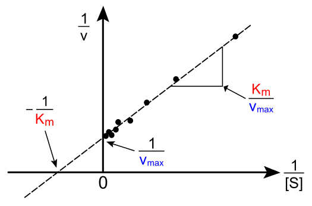
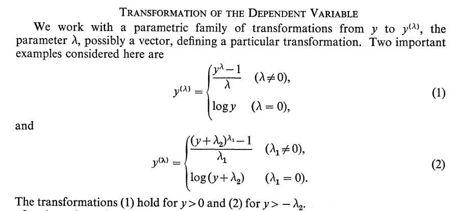

```{r setup, include=FALSE}
library(LM2GLMM)
knitr::opts_chunk$set(cache = TRUE, cache.path = "./cache_knitr/LM_assumptions/", fig.path = "./fig_knitr/LM_assumptions/", fig.align = "center", fig.width = 4, fig.height = 4)
options(width = 200)
```

## You will learn in this session

# Introduction

## The main assumptions

### Model structure

* linearity
* lack of multicollinearity (design matrix of full rank)
* predictor variables have fixed values

### Errors

* constant variance (homoscedasticity)
* independence (no serial autocorrelation)
* normality

# Assumptions about the model structure

# Linearity

## Linearity in brief

### Assumption

The mean of the response variable must be a linear combination of the parameters and the predictor variables, with no systematic dependence on any omitted terms.


### Causes and consequences of violation

Departure from linearity can originate from a multitude of reasons and can create all kinds of problems.

### Solution

* transform one or several predictors (e.g. polynomials)
* transform the response (e.g. log and power transformation)

### Alternative

* non-linear models


## Quiz

### Can you express the following models as LM?

* <font size = 8>$y_i = \alpha + \epsilon_i$ </font>
* <font size = 8>$y_i = x_i^\beta + \epsilon_i$ </font>
* <font size = 8>$y_i = \alpha + \beta_1 x_i + \beta_2 x_i^2 + \beta_3 x_i^3 + \epsilon_i$ </font>
* <font size = 8>$y_i = \frac{\beta x_i}{\alpha + x_i} + \epsilon_i$ </font> (Michaelis-Menten : V = Vmax[S]/(Km+[S]))

## Lineweaver Burk method for Michaelis-Menten

<center>  </center>

<br>

But using this method is not advised as results can be unreliable...

## Example of non-linearity

```{r poison}
data(poison, package = "fastR")  ##  ?fastR::poison for description
poison$treat <- factor(poison$Treatment)
poison$poison <- factor(poison$Poison)
mod_poison <- lm(Time ~ poison + treat, data = poison)
plot(rstandard(mod_poison) ~ fitted(mod_poison), xlab = "fitted values",
     ylab = "standardized residuals")  ## see later
abline(h = 0, col = "red", lty = 2)
```

## The Box-Cox transformation (Box & Cox 1964)

<center>  </center>

## The Box-Cox transformation (Box & Cox 1964)

### It encompasses several classic transformations:

* log transformation ($\lambda = 0$)
* inverse transformation ($\lambda = -1$)
* square root transformation ($\lambda = 1/2$)
* square transformation ($\lambda = 2$)

<br>

(but it changes intercept and rescale the $\beta$)


## The Box-Cox transformation (Box & Cox 1964)

```{r boxcox}
library(MASS)
bc <- boxcox(mod_poison)  ## makes logLik profile!
```

We will consider -1 instead of ```r round(bc$x[which.max(bc$y)], 2)``` as it is close enough and easier to interpret!

## Poison example linearised

```{r poison bc}
mod_poison2 <- update(mod_poison, (Time^-1 - 1)/(-1) ~ .)
plot(rstandard(mod_poison2) ~ fitted(mod_poison2), xlab = "fitted values",
     ylab = "standardized residuals")  ## see later
abline(h = 0, col = "red", lty = 2)
```

## Poison example linearised

### Predictions
```{r poison pred}
data.for.pred <- expand.grid(treat = levels(poison$treat), poison = levels(poison$poison))
(pred <- cbind(data.for.pred, predict(mod_poison2, newdata = data.for.pred, interval = "confidence")))
```

There are in the Box-Cox scales. In this case, it represents the survival rate, but you can always get back to the original scale:

```{r pred unbc}
lambda <- -1; (pred$fit * lambda + 1)^(1/lambda)
```

## Comparison of tests

```{r poison summary}
summary(mod_poison) ## the original model
```

## Comparison of tests

```{r poison bc summary}
summary(mod_poison2) ## the boxcoxed model
```

# Lack of multicollinearity

## Lack of multicollinearity in brief

### Assumption

The design matrix must have full rank. That means that the number of parameters to be estimated must be equal to the rank of the design matrix.

### Causes and consequences of violation

Caused by having less data than parameters or when there is linear dependence between the column vectors of the design matrix. In such case, some parameters cannot be computed.

### Solution

* change design matrix (change parameterization or drop redundant effects)
* change the experimental design
* collect more data

### Alternative

* none

## Degenerated design matrix: ```n < p```
```{r degenerated n too small, error = TRUE}
set.seed(1L)
N <- 3
Alien <- data.frame(humans_eaten = 1:N,
                     flowers_eaten = round(runif(N, min = 1, max = 15)),
                     cactus_eaten =  round(runif(N, min = 1, max = 10)))

Alien$size <- rnorm(n = nrow(Alien),
  mean = 50 + 0.2 * Alien$humans_eaten + 0.9 * Alien$flowers_eaten + 0.1 * Alien$cactus_eaten,
  sd = sqrt(25))

mod_alien1a <- lm(size ~  cactus_eaten + humans_eaten + flowers_eaten, data = Alien)
coef(mod_alien1a)
mod_alien1b <- lm(size ~  humans_eaten + flowers_eaten + cactus_eaten, data = Alien)
coef(mod_alien1b)
```


## Degenerated design matrix: trivial redundancy

```{r degenerated redundancy, error = TRUE}
set.seed(1L)
Alien2 <- simulate_Aliens()
Alien2$half_humans_eaten <-  0.5 * Alien2$humans_eaten
mod_alien2 <- lm(size ~ humans_eaten + half_humans_eaten, data = Alien2)
coef(mod_alien2)
det(crossprod(model.matrix(mod_alien2)))  ## when det(XTX) <= 0, XTX has no inverse!
mod_alien2$rank  == ncol(model.matrix(mod_alien2))
```

## Degenerated design matrix: miscellaneous

```{r degenerated redundancy subtle, error = TRUE}
set.seed(1L)
Alien3 <- data.frame(humans_eaten = 1:12,
                     flowers_eaten = round(runif(12, min = 1, max = 15)),
                     cactus_eaten = 0)
Alien3$food_units <- 1.2*Alien3$humans_eaten + 0.6*Alien3$flowers_eaten
Alien3$size <- rnorm(n = 12, mean = 50 + 1*Alien3$food_units, sd = sqrt(25))
mod_alien3 <- lm(size ~ food_units + humans_eaten + flowers_eaten + cactus_eaten, data = Alien3)
coef(mod_alien3)
caret::findLinearCombos(model.matrix(mod_alien3))  ## Tip: help to see what creates the issue
```


## Chalenge: analysing the Fungi dataset

```{r fungi}
head(Fungi)
```

<br>

### Goal:

quantifying the average growth rate of alive fungi for each species,
in each experimental condition, using a single linear model.

([solution](./Fungi_1.html))

# Predictor variables have fixed values

## Predictor variables have fixed values (in brief)

### Assumption

The dependent variable are represented by fixed values.

### Causes and consequences of violation

The presence of measurement errors is the main cause of violation. Violation can trigger both estimates and tests to be biased.

### Solution

* often ignored in practice
* better measurements

### Alternative

* reduced major axis regression
* errors-in-variables models
* numerical approaches

## Example

```{r measurement error}
Alien4 <- simulate_Aliens(100)
summary(lm(size ~ humans_eaten, data = Alien4))$coef
Alien4$humans_eaten_err <- Alien4$humans_eaten + rnorm(nrow(Alien4), sd = 20)
summary(lm(size ~ humans_eaten_err, data = Alien4))$coef
```

## Accounting for error in variable using numerical fits

```{r sem}
library(sem)
eqns <- specifyEquations(text = "
                        size = alpha*Intercept + slope*humans_eaten
                        humans_eaten = 1*humans_eaten_err
                        V(size) = sigma
                        V(humans_eaten) = 1
                        V(humans_eaten_err) = phi
                        ")
fitted.mod <- sem(eqns, data = Alien4, raw = TRUE, fixed.x = "Intercept")
summary(fitted.mod)$coef
```


## Independence

A lack of independence (serial autocorrelation) in the residuals can appear if there is a departure from linearity and/or if data have been sampled non-randomly (e.g. spatial or temporal series)


# How to test some assumptions

# How to visually check some assumptions

# What happens when assumptions are not met?

# How to fix departure from assumptions?


# Outliers

## Detecting outliers

```{r}
influence.measures(mod_poison)
```


## What you need to remember

# Table of content

## The Linear Model: LM

* 2.0 [Introduction](./LM_intro.html)
* 2.1 [Point estimates](./LM_point_estimates.html)
* 2.2 [Uncertainty in point estimates](./LM_uncertainty.html)
* 2.3 [Tests](./LM_tests.html)
* 2.4 [Assumptions](./LM_assumptions.html)
